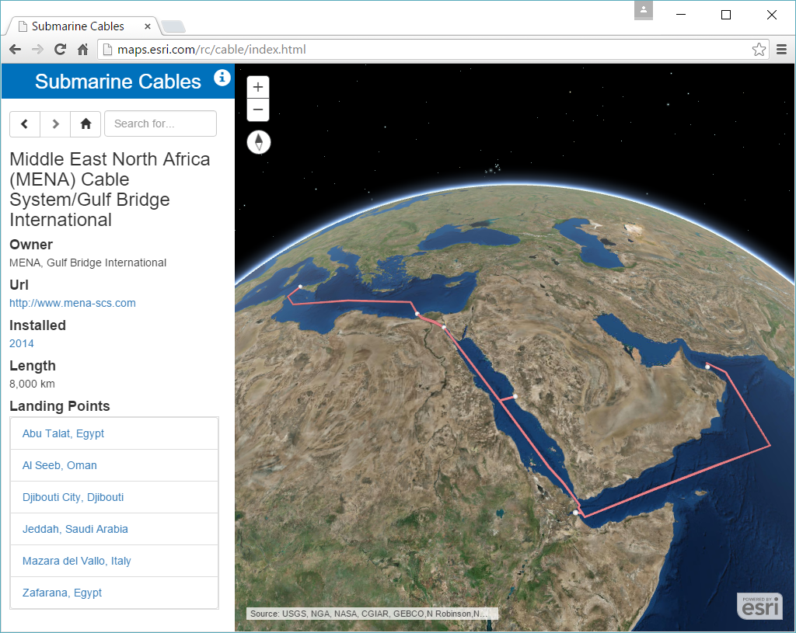
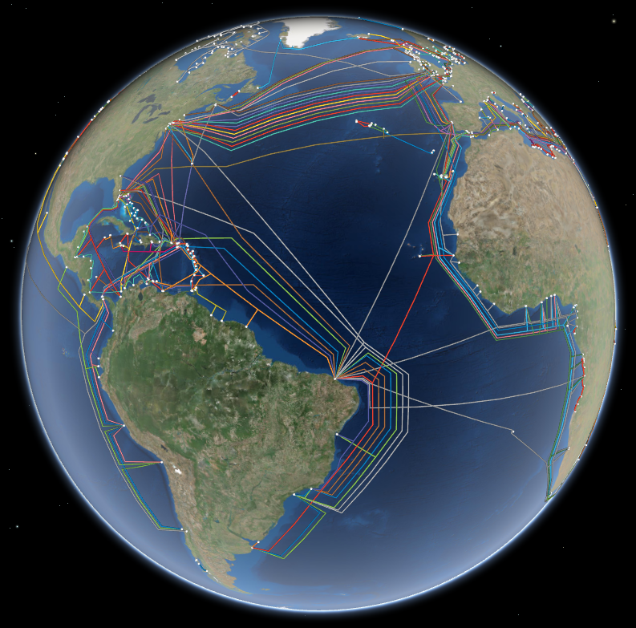
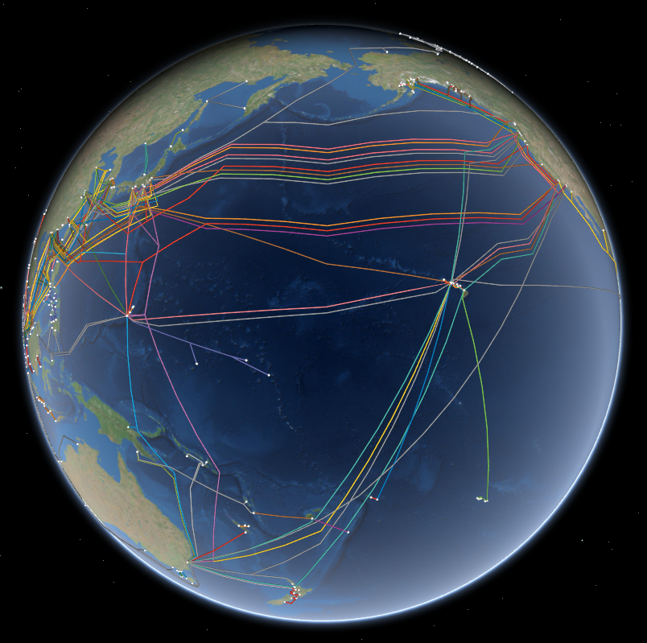

# Submarine Cable Map

This application was designed and developed by [Esri](http://www.esri.com/)'s [Applications Prototype Lab](http://blogs.esri.com/esri/apl/) in Redlands, California using Esri's [ArcGIS API for JavaScript](https://developers.arcgis.com/javascript/) ([beta](https://developers.arcgis.com/javascript/beta/)).

This application maps the global network of submarine communication cables. This app was inspired by [TeleGeography](https://www.telegeography.com/)'s awesome [Submarine Cable Map](http://www.submarinecablemap.com/).

Data for this application was prepared by [TeleGeography](https://www.telegeography.com/) and published [here](https://github.com/telegeography/www.submarinecablemap.com). This data represents a cartographic representation of the actual data. For more information on, and access to, the authoritative data please visit the [Global Bandwidth Research Service](https://www.telegeography.com/research-services/global-bandwidth-research-service/index.html).

Data was downloaded from [here](https://www.google.com/fusiontables/DataSource?docid=1ThJlnFAEBqJdYWKCdcnqdsjSJE1mnzkwaOh3fL3X#map:id=3) and [here](https://www.google.com/fusiontables/DataSource?docid=117TmsWlGqILvN0UZYP9rhFhlWG_1lYdQw3-6CtTX#map:id=3) as KML documents. The data is current as of November 2015.

#### Screenshots:

